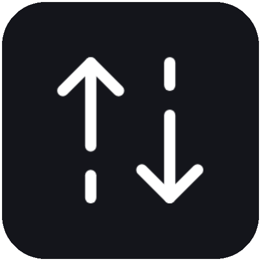

<div align="center">
  
  
  # Encode-All
  
  **A Modern FFmpeg GUI for Bulk Video Encoding**
  
  [](https://www.electronjs.org/)
  [](https://reactjs.org/)
  [](https://www.typescriptlang.org/)
  [](https://tailwindcss.com/)
  [](LICENSE)

[Features](#features) • [Installation](#installation) • [Development](#development) • [Release](#release) • [Tech Stack](#tech-stack)

</div>

---

## Overview

**Encode-All** is a cross-platform desktop application that provides a sleek, modern interface for bulk video encoding using FFmpeg.

## Features

### Core Functionality

- **Batch & Queue** – Add folders, run sequential encodes with progress and status monitoring
- **Formats & Codecs** – MP4/MKV/AVI/WebM support; H.264, H.265, VP9, AV1

### User Experience

- **Modern UI & Themes** – Sleek design with light/dark mode
- **Live Feedback** – FFmpeg command preview and real-time progress

### Encoding Configuration

- **Codec & Audio Controls** – Video/audio codec, bitrate, channels, thread tuning
- **Output Management** – Easy custom naming and output directory selection

### Technical Features

- **FFmpeg Auto-Detection** – Automatically tries to locate FFmpeg on the system for seamless operation.

## Installation

Download the latest installer for your operating system from the
[GitHub Releases](https://github.com/serch3/encode-all/releases) page.

Encode-All requires FFmpeg and FFprobe to encode and inspect media. If they are
available on your system `PATH`, the app detects them automatically. You can also
select a custom FFmpeg executable from Settings. FFprobe should live next to the
selected FFmpeg binary.

## Development

### Setup

```bash
# Clone the repository
git clone https://github.com/serch3/encode-all.git
cd encode-all

# Install dependencies
npm install
```

### Development Mode

```bash
# Start the application in development mode with hot-reload
npm run dev
```

### Testing

```bash
# Run unit tests
npm test

# Run tests in watch mode
npm run test:watch

# Generate coverage report
npm run test:coverage
```

### Building

```bash
# Build for Windows
npm run build:win

# Build for macOS
npm run build:mac

# Build for Linux
npm run build:linux
```

## Release

Release builds are created by the GitHub Actions workflow in
`.github/workflows/release.yml`.

```bash
# Create and push a version tag
git tag v0.7.0
git push origin v0.7.0
```

The workflow builds Windows, macOS, and Linux artifacts, uploads them to a draft
GitHub release, and generates release notes. Review the draft release before
publishing it publicly.

Windows and macOS artifacts are unsigned unless signing credentials are provided
to Electron Builder through repository secrets. Unsigned builds are useful for
testing, but public releases should be signed before publishing.

## Tech Stack

### Frontend

- **[React](https://reactjs.org/)** – UI library
- **[TypeScript](https://www.typescriptlang.org/)** – Type-safe JavaScript
- **[Tailwind CSS](https://tailwindcss.com/)** – Utility-first CSS framework
- **[HeroUI](https://www.heroui.com/)** – Modern React component library
- **[Framer Motion](https://www.framer.com/motion/)** – Animation library
- **[Lucide React](https://lucide.dev/)** – Icon library

### Desktop Framework

- **[Electron](https://www.electronjs.org/)** – Cross-platform desktop apps
- **[Electron Vite](https://electron-vite.org/)** – Fast build tooling
- **[Electron Builder](https://www.electron.build/)** – Packaging and distribution

### Development Tools

- **[Vite](https://vitejs.dev/)** – Next-generation frontend tooling
- **[Jest](https://jestjs.io/)** – Testing framework
- **[ESLint](https://eslint.org/)** – Code linting
- **[Prettier](https://prettier.io/)** – Code formatting

### Backend Processing

- **[FFmpeg](https://ffmpeg.org/)** – Multimedia framework for video/audio processing

## Contributing

Feel free to open issues and submit pull requests! There is a lot of room for improvements.

## License

This project is licensed under the MIT License - see the [LICENSE](LICENSE) file for details.

## Author

**Sergio Mandujano** – [GitHub](https://github.com/serch3)
